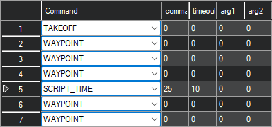

# Point Toward Home

This Lua script is intended for use on an ArduPilot Copter during auto missions. When activated, the Copter will pause at its present position and point (yaw) toward the home location before continuing the misison.

# How to Use

Install this script in the autopilot's SD card's APM/scripts directory. Set SCR_ENABLE to 1 and reboot the autopilot.

Create an auto mission with `SCRIPT_TIME` commands to trigger the script feature. Each `SCRIPT_TIME` command should have an ID of 25. The timeout argument determines the duration of the pause.

In the below example, the Copter will arrive at waypoint 4, pause for 10 seconds while pointing toward home, and then continue to waypoint 6.

